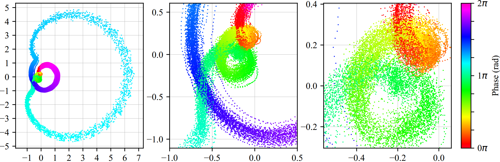

# Unsupervised Phase Learning
Supplementary materials and preprint for a paper "Unsupervised Phase Learning and Extraction from Quasiperiodic Multidimensional Time-series Data".



## Videos
Proceed to this playlist 
https://www.youtube.com/playlist?list=PLz_fePYLwCF4OKExZV9XqGS6PM1uE4Feb

## Preprint?
Currently, the full text paper (PDF) and all supplementary materials are available for free at https://authors.elsevier.com/a/1b54P5aecShD%7EW until July 06, 2020. After that, the preprint will be uploaded here.

## Citation
```
@article{JATESIKTAT2020106386,
title = "Unsupervised phase learning and extraction from quasiperiodic multidimensional time-series data",
journal = "Applied Soft Computing",
volume = "93",
pages = "106386",
year = "2020",
issn = "1568-4946",
doi = "https://doi.org/10.1016/j.asoc.2020.106386",
url = "http://www.sciencedirect.com/science/article/pii/S1568494620303264",
author = "Prayook Jatesiktat and Guan Ming Lim and Christopher Wee Keong Kuah and Wei Tech Ang"
}
```
